# API Reference — Package Overview

The app is organized into 5 packages following MVVM architecture.

## Package Structure

```mermaid
%%{init: {'theme': 'default'}}%%
graph LR
    subgraph ui["ui/ — UI Layer"]
        MA["MainActivity"]
        Splash["SplashFragment"]
        Welcome["WelcomeFragment"]
        Home["HomeFragment"]
        History["HistoryFragment"]
        Product["ProductDetailFragment"]
        Settings["SettingsFragment"]
        About["AboutFragment"]
        Adapters["3 Adapters"]
    end
    subgraph model["model/ — ViewModels"]
        HVM["HomeViewModel"]
        PVM["ProductViewModel"]
        HiVM["HistoryViewModel"]
    end
    subgraph data["data/ — Data Layer"]
        Entities["Product, ScanHistory"]
        DAOs["ProductDao, ScanHistoryDao"]
        DB["AppDatabase"]
        Repo["ShoppingRepository"]
    end
    subgraph network["network/ — Network"]
        Groq["GroqClient"]
        Edge["EdgeTtsClient"]
        AIM["AiRecommendationManager"]
        Cache["RecommendationCache"]
    end
    subgraph util["util/ — Utilities"]
        NFC["NfcHelper"]
        TTS["TtsHelper"]
        Tash["TashkeelHelper"]
        Locale["LocaleHelper"]
        Prefs["PreferencesManager"]
        Spot["SpotlightOverlayView"]
        Tut["TutorialManager"]
    end

    ui --> model
    model --> data
    model --> network
    network --> data

```

## Class Count by Package

| Package | Classes | Purpose |
|---------|---------|---------|
| `ui/` | 11 | Fragments, Adapters, Activity |
| `model/` | 3 | ViewModels |
| `data/` | 5 | Entities, DAOs, DB, Repository |
| `network/` | 4 | AI, TTS, Cache |
| `util/` | 7 | Helpers |
| **Total** | **33** | |

## Dependencies

| Library | Version | Purpose |
|---------|---------|---------|
| Material Design 3 | 1.11.0 | UI components |
| Navigation Component | 2.7.7 | Fragment navigation |
| Room | 2.6.1 | SQLite ORM |
| Lifecycle | 2.7.0 | ViewModel + LiveData |
| OkHttp | 4.12.0 | WebSocket (TTS) + HTTP (AI) |
| SplashScreen | 1.0.1 | Android 12+ splash |
