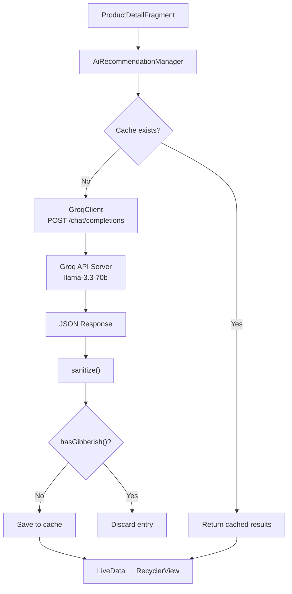
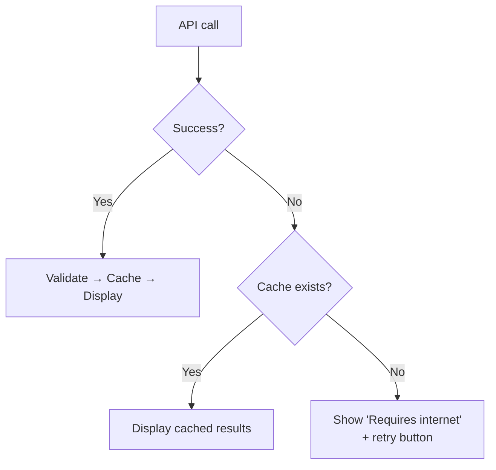

# AI Recommendation Pipeline

## Summary

The AI pipeline generates personalized food product recommendations based on the scanned product, user dietary profile, and allergen data. It uses **Groq API** with `llama-3.3-70b-versatile`, with local caching for offline access.

---

## Pipeline Architecture

---

## Prompt Structure

Two messages sent to Groq's chat completions endpoint:

**System message** — tells the AI it's a food safety assistant and that wrong suggestions could cause allergic reactions.

**User message** — assembled from four sources:

| Source | What it contains |
|--------|-----------------|
| Product info | Name, ingredients, allergens, nutrition |
| User profile | Dietary restrictions (diabetic, vegan, etc.) |
| BANNED list | Products explicitly banned per restriction (e.g. nut allergy → ban almond, cashew, hazelnut) |
| Hidden allergens | Non-obvious mappings (whey/casein = dairy, soy lecithin = soy) |

The prompt ends with a **VERIFY step** that forces the model to check each suggestion against the BANNED list before responding.

---

## Model Configuration

| Parameter | Value | Why |
|-----------|-------|-----|
| Model | `llama-3.3-70b-versatile` | Best quality/speed on Groq |
| Temperature | `0.1` | Near-deterministic — food safety needs precision |
| Max tokens | `2048` | Enough for 3 recommendations with full data |

---

## Response Format

Each recommendation in the JSON array:

| Field | Description |
|-------|-------------|
| `name` | English product name |
| `nameAr` | Arabic product name |
| `reason` | Why this suits the user |
| `matchPercent` | 0-100 compatibility score |
| `calories`, `protein`, `carbs`, `fat` | Nutrition data |
| `ingredients` / `ingredientsAr` | Bilingual ingredients |

---

## Safety Validation

Every response passes through two checks:

- **`sanitize()`** — strips characters that aren't Arabic, English, or common punctuation
- **`hasGibberish()`** — detects CJK characters (the model sometimes hallucinates these when Arabic confuses its tokenizer)

Any entry that fails either check is silently dropped.

---

## Fallback Strategy

Stale cached results are preferred over no results — food product data doesn't change often.
