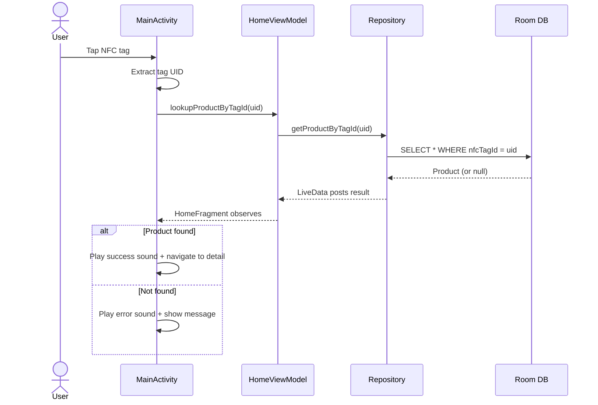
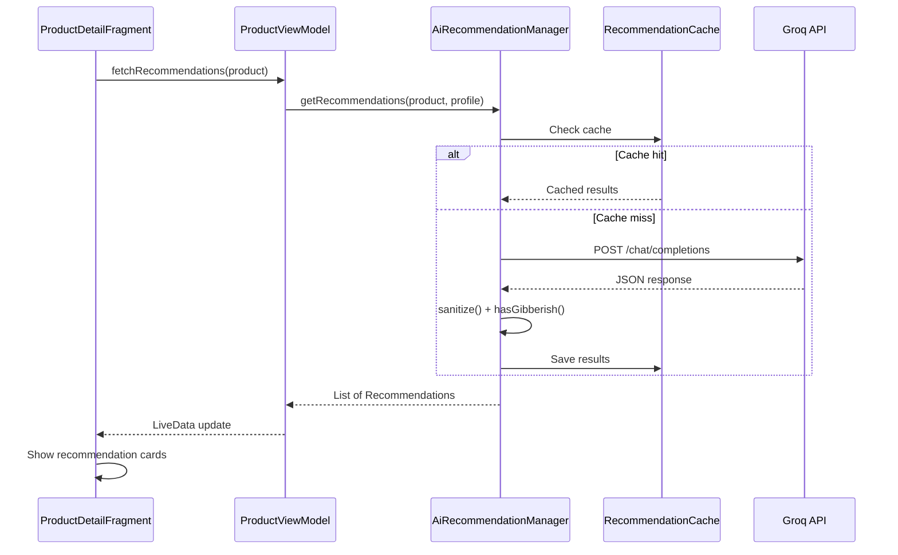

# Data Flow

## Summary

All data flows through a unidirectional pipeline: **user action → ViewModel → Repository → data source → LiveData → UI update**. This page traces the two primary flows.

---

## Flow 1: NFC Product Lookup

The core journey — scanning a product tag and viewing its details.



### Step-by-Step

1. **NFC tag detected** — Android delivers an intent to `MainActivity.onNewIntent()`
2. **UID extraction** — `NfcHelper.extractTagId()` reads the tag's hardware UID as a hex string
3. **Database lookup** — ViewModel asks Repository, which runs a Room query on a background thread
4. **LiveData emission** — Result posted via `postValue()` (thread-safe, auto-dispatches to main thread)
5. **UI response** — Fragment observes the result. Found → navigate to detail. Not found → error feedback.
6. **Sound + vibration** — Success: chime + short vibration. Error: alert tone + longer vibration.

---

## Flow 2: AI Recommendation Loading

Triggered when the product detail screen opens.



### Step-by-Step

1. **Fragment ready** — `onViewCreated()` calls `viewModel.fetchRecommendations(product)`
2. **Cache check** — Look for previously cached results for this product
3. **Cache hit** — Serve cached data immediately (skip API call)
4. **API call** — Send structured prompt to Groq with product info + user profile
5. **Validation** — `sanitize()` strips bad characters, `hasGibberish()` catches encoding issues
6. **Cache write** — Valid results saved for offline access
7. **UI update** — LiveData fires observer, RecyclerView shows recommendation cards

---

## LiveData Pattern

All ViewModel-to-Fragment communication uses LiveData. The pattern is consistent:

```java
viewModel.getProducts().observe(getViewLifecycleOwner(), products -> {
    if (products != null && isAdded()) {
        adapter.submitList(products);
    }
});
```

- Uses `getViewLifecycleOwner()` (not `this`) to avoid memory leaks
- `isAdded()` guard prevents detached-fragment crashes
- `postValue()` from background threads is safe — LiveData handles the thread switch

---

## Error Handling

| Error Source     | What Happens                                         |
|-----------------|------------------------------------------------------|
| Room query null | Fragment shows "product not found" state              |
| Network failure | Falls back to cache; no cache → "requires internet"  |
| JSON parse fail | Entry dropped, show retry button                      |
| NFC read fail   | Error sound, snackbar message, stay on home screen    |
