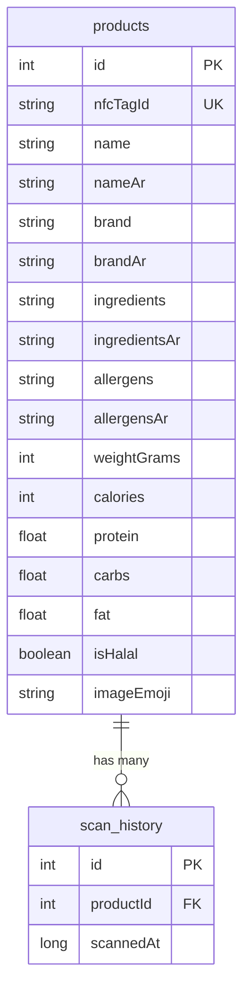

# Database Design

## Summary

The app uses **Room Persistence Library** as its local database, wrapping SQLite with compile-time query verification and LiveData integration. It stores product catalog data and scan history, seeded with 15 pre-loaded Saudi market products.

---

## Schema

---

## Product Entity

Represents a physical store product mapped to an NFC tag. Key design choices:

| Field | Design Choice |
|-------|--------------|
| `nfcTagId` | Hex string with colons (e.g. `"04:A3:2B:1C"`) for readability |
| `nameAr` | Includes tashkeel diacritics for TTS pronunciation |
| `allergens` | Comma-separated string (simple enough for 15 products) |
| `imageEmoji` | Single emoji instead of bitmap — no image hosting needed |

---

## Scan History Entity

Records each scan with a timestamp. Foreign key to products with CASCADE delete — if a product is removed, its scan history goes with it.

---

## DAOs

**ProductDao** — lookup by NFC tag ID, by product ID, search by name (supports both English and Arabic), get all, insert batch.

**ScanHistoryDao** — insert scan, get all (newest first), get recent 5, count, delete all.

---

## Database Configuration

| Setting | Value | Why |
|---------|-------|-----|
| Version | 5 | Incremented through development |
| Destructive migration | Enabled | Pre-seeded data rebuilds on upgrade — no user data to lose |
| Singleton | Double-checked locking | Thread-safe single instance |

---

## Seeding

Products are seeded via the `onOpen` callback with a `count() == 0` guard. We use `onOpen` instead of `onCreate` because destructive migration wipes the database — `onOpen` fires every app start and re-seeds when the table is empty.

### Pre-seeded Products (15 items)

Common Saudi market products with full bilingual data and tashkeel diacritics. Examples: Almarai Full Fat Milk, Nadec Laban, Al Safi Danone Yogurt, Indomie Noodles, KDD Orange Juice, and 10 more.

---

## Repository Pattern

`ShoppingRepository` wraps both DAOs and runs all database operations on a background executor thread. Results communicate to UI via `LiveData.postValue()` — thread-safe and auto-dispatches to the main thread.
