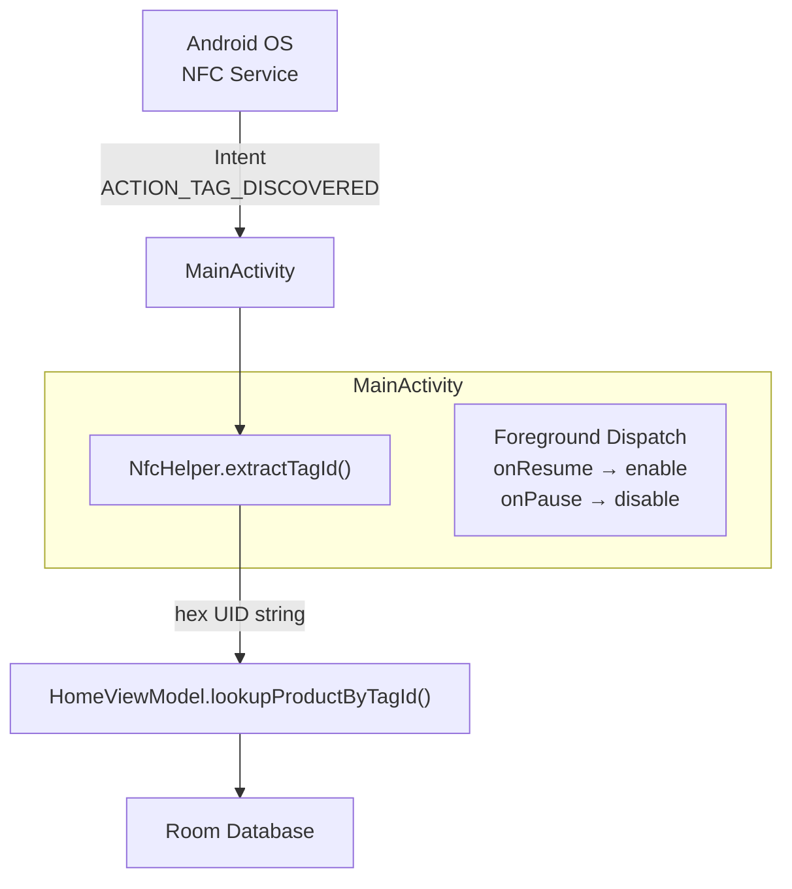

# NFC System

## Summary

The NFC subsystem reads physical product tags and maps them to database records. It uses **UID-based identification** — compatible with any NFC tag regardless of format. The system spans three classes: `NfcHelper` (UID extraction), `MainActivity` (dispatch management), and `SplashFragment` (cold-start handling).

---

## Architecture

---

## How UID Extraction Works

`NfcHelper.extractTagId()` reads the raw tag bytes and converts them to a hex string like `"04:A3:2B:1C:8E:00:01"`. That string is the lookup key in our database.

### Why UID, Not NDEF?

| Approach | What it does | Why we didn't choose it |
|----------|-------------|------------------------|
| **UID-based** (chosen) | Read the tag's hardware ID | — |
| NDEF-based | Read custom data written to the tag | Requires writing data to each tag — extra step we don't need |

UID works with any blank NFC sticker. No tag programming needed — just stick it on a product and register the UID.

---

## Foreground Dispatch

Android NFC has a priority system. **Foreground Dispatch** gives our running activity first priority over other NFC apps on the device.

- `onResume()` → enable listening
- `onPause()` → disable listening
- `onNewIntent()` → receive the scanned tag

### Launch Mode: singleTop

Without `singleTop`, each NFC scan would create a new Activity instance, stacking duplicates. With it, re-scans deliver to `onNewIntent()` on the existing instance.

---

## Background Scan Handling

When the app isn't running and the user taps a tag, Android launches the app via `onCreate()` with the NFC intent. `SplashFragment` detects this and skips the splash animation — navigates straight to the home screen where the tag gets processed immediately.

---

## Audio and Haptic Feedback

Scan results give immediate sensory feedback:

| Event | Sound | Vibration |
|-------|-------|-----------|
| Product found | Ascending chime | 150ms pulse |
| Product not found | Descending alert | 300ms pulse |

Both fire simultaneously — users who can't hear the chime feel the vibration, and vice versa.
