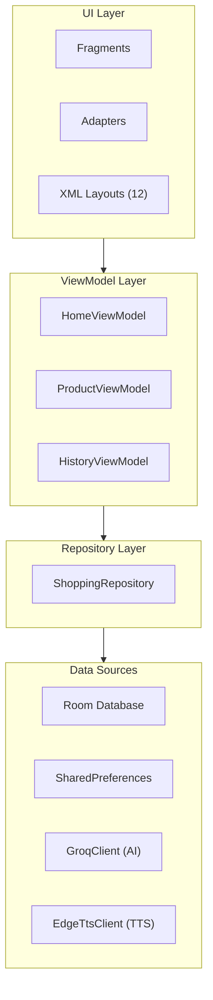
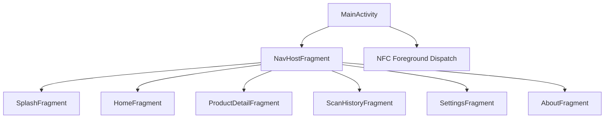

# Architecture Overview

## Summary

The NFC-AI Shopping Assistant is a single-activity Android application built on **MVVM** (Model-View-ViewModel). The codebase has **33 Java classes** and **12 XML layouts**, organized into five packages with strict separation of concerns.

---

## Layer Diagram

Data flows **downward** through method calls and **upward** through `LiveData` observation. No layer may skip a level — Fragments never access the database directly.

---

## Package Structure

| Package        | Responsibility                          | Key Classes                                        |
|----------------|------------------------------------------|----------------------------------------------------|
| `ui/`          | Fragments, adapters, custom views        | `HomeFragment`, `ProductDetailFragment`, `ScanHistoryAdapter` |
| `model/`       | Room entities and data classes           | `Product`, `ScanHistory`                           |
| `data/`        | Database, DAOs, repository, preferences  | `AppDatabase`, `ProductDao`, `ShoppingRepository`  |
| `network/`     | API clients and AI pipeline              | `GroqClient`, `EdgeTtsClient`, `AiRecommendationManager` |
| `util/`        | Helpers and utilities                    | `NfcHelper`, `TtsHelper`, `TashkeelHelper`         |

---

## Single Activity Architecture

The app uses a single `MainActivity` with the Jetpack Navigation Component managing fragment transactions.

> **Why single activity?** NFC foreground dispatch must be registered at the Activity level. A single activity ensures one consistent dispatch point regardless of which fragment is visible.

### Navigation Graph

Navigation actions are defined in `nav_graph.xml`. Safe Args pass product IDs between fragments. The back stack is managed automatically.

---

## Fragment Lifecycle Management

Android fragment lifecycles can cause crashes from async callbacks. We guard against this:

- **`isAdded()` checks** — every async callback that touches UI wraps in `if (isAdded() && getView() != null)`
- **`view.post()`** — Room queries and network calls run on background threads, results posted to main thread via `LiveData.postValue()`
- **Null view binding** — `onDestroyView()` nullifies view references to prevent memory leaks

---

## Key Architectural Decisions

| Decision                          | Rationale                                                        |
|-----------------------------------|------------------------------------------------------------------|
| MVVM over MVP                     | LiveData provides lifecycle-aware observation; reduces boilerplate |
| Room over raw SQLite              | Compile-time SQL verification, built-in LiveData support          |
| Single Activity                   | Simplifies NFC dispatch, deep linking, and navigation state       |
| Executors over Coroutines         | Project is pure Java; executors are the idiomatic threading model |
| SharedPreferences for AI cache    | Simple key-value storage; AI responses are small JSON strings     |

---

## Class Count Breakdown

| Package    | Classes | Notes                              |
|------------|---------|-------------------------------------|
| `ui/`      | 12      | 7 fragments, 3 adapters, 2 dialogs |
| `model/`   | 3       | 2 entities, 1 data class            |
| `data/`    | 6       | DB, 2 DAOs, repository, prefs, seed |
| `network/` | 5       | Groq, Edge TTS, AI manager, cache   |
| `util/`    | 7       | NFC, TTS, tashkeel, misc helpers    |
| **Total**  | **33**  |                                     |

---

## Build Configuration

- **minSdk:** 21 (Android 5.0)
- **targetSdk:** 34 (Android 14)
- **Language:** Java 17
- **Dependencies:** AndroidX Navigation, Room, LiveData, Material Components, OkHttp
- **Build system:** Gradle with version catalogs
