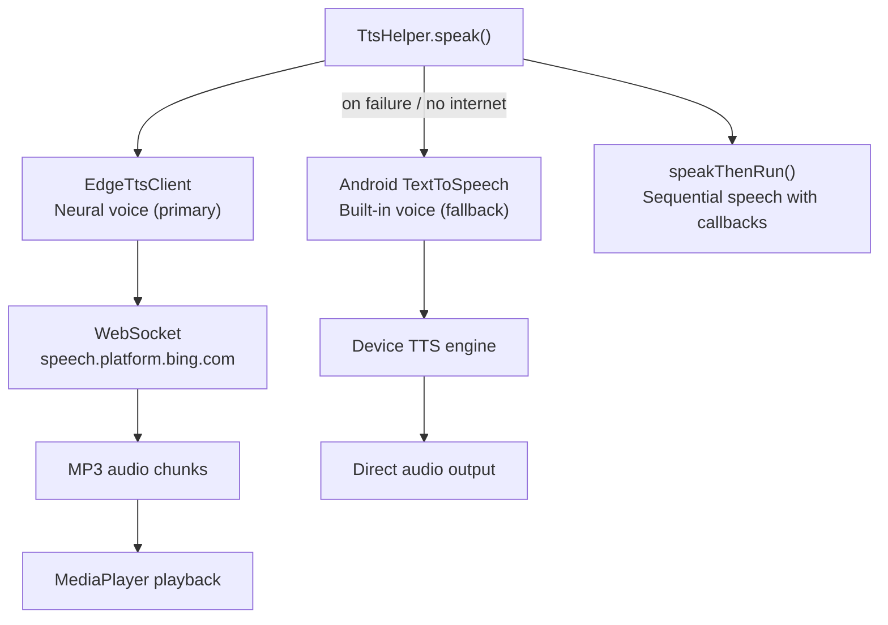

# TTS Engine

## Summary

The text-to-speech system provides bilingual voice output (Arabic and English). It uses a **dual-backend architecture**: Microsoft Edge TTS as the primary high-quality engine, with Android's built-in TTS as automatic fallback.

---

## Architecture

---

## Primary: Edge TTS

Connects to Microsoft's Edge browser TTS service via WebSocket. Neural voice quality — significantly better than Android's built-in engine, especially for Arabic.

**How it works:**

1. Compute a DRM authentication token (SHA-256 based)
2. Open WebSocket to Microsoft's server
3. Send SSML (Speech Synthesis Markup Language) with the text and voice settings
4. Receive MP3 audio chunks
5. Write to temp file → play via MediaPlayer

**Voices:**

| Language | Voice | Notes |
|----------|-------|-------|
| Arabic | `ar-SA-ZariyahNeural` | Saudi female, high clarity |
| English | `en-US-JennyNeural` | American female, natural tone |

---

## Fallback: Android TTS

The built-in `TextToSpeech` engine activates when Edge TTS fails — no network, timeout (5s), or WebSocket error. Lower quality but works offline.

---

## Speed Control

Users adjust speech rate in Settings (x0.5 / x1 / x1.5):

- **Edge TTS** — SSML prosody rate (e.g. `+50%`, `-50%`)
- **Android TTS** — float multiplier (e.g. `0.7f`, `1.0f`, `1.3f`)

---

## Preventing Overlapping Audio

A `speakGeneration` counter increments with each `speak()` call. When audio becomes ready, the callback checks if its generation still matches the current value. If a newer call was made, the old audio is discarded. Simpler and more reliable than canceling WebSocket connections mid-flight.

---

## Sequential Speech: speakThenRun()

Product detail reads multiple sections in order: name → nutrition → ingredients → allergens → recommendations. `speakThenRun()` chains these with completion callbacks — each segment starts only after the previous one finishes.

---

## Arabic Diacritics (Tashkeel)

Arabic text is stored in the database **with full diacritics** (fatha, kasra, damma, etc.). These are critical for correct pronunciation:

| Context | Handling | Why |
|---------|----------|-----|
| TTS input | Keep diacritics | Correct pronunciation |
| UI display | Strip diacritics | Cleaner appearance |
| Database | Stored with diacritics | Single source of truth |

Example: stored as `"حَلِيبُ المَرَاعِي"` → displayed as `"حليب المراعي"` → spoken with full vowels.
