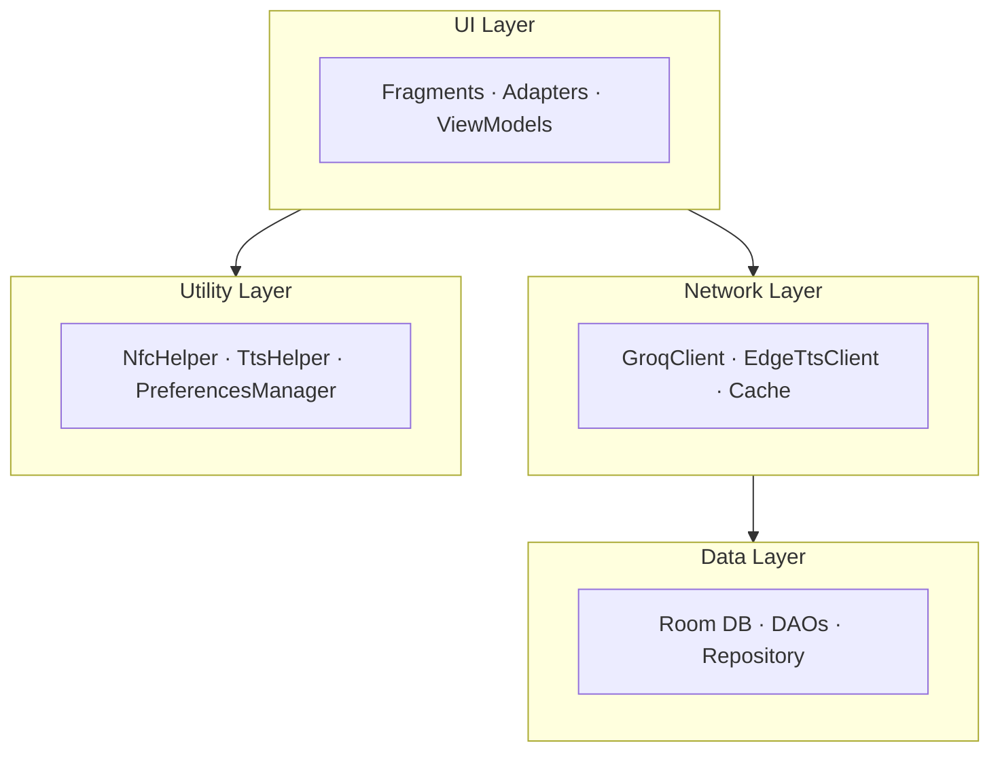

# NFC-AI: Smart Shopping Assistant

**Senior Project — Saudi Electronic University, College of Computing and Informatics**

---

## What is NFC-AI?

NFC-AI is an accessibility-focused Android shopping assistant that helps users — especially those with food allergies and visual impairments — make safer grocery choices. By tapping their phone on an NFC-tagged product, users instantly receive:

- Full nutritional information (calories, protein, carbs, fat)
- Allergen warnings matched to their personal dietary profile
- AI-powered alternative product recommendations
- Voice readout of all product information via neural text-to-speech

## Key Features

| Feature | Technology |
|---------|-----------|
| Instant product scanning | NFC (UID-based lookup) |
| AI-safe alternatives | Groq LLM (llama-3.3-70b) |
| Neural voice readout | Microsoft Edge TTS + Android fallback |
| Bilingual support | Arabic + English with tashkeel |
| Allergen detection | Real-time profile matching |
| Offline support | Recommendation caching + offline TTS |
| Onboarding tutorial | Custom spotlight overlay system |

## Architecture at a Glance

## Tech Stack

- **Language:** Java 17
- **Architecture:** MVVM + Repository Pattern
- **Database:** Room (SQLite ORM)
- **UI:** Material Design 3
- **Navigation:** AndroidX Navigation Component
- **AI:** Groq API (llama-3.3-70b-versatile)
- **TTS:** Microsoft Edge Neural TTS (WebSocket) + Android fallback
- **NFC:** Android NFC Foreground Dispatch
- **Min SDK:** 26 (Android 8.0)
- **Target SDK:** 34 (Android 14)

## Team

| Name | Role |
|------|------|
| Hassan AlHassan | Developer |
| Khalid AlHelal | Developer |
| Ibrahim AlSayah | Developer |
| Mohammed AlHajji Ahmed | Developer |
| Ali AlQadhib | Developer |

**Supervisor:** Dr. Moner AlSader — Saudi Electronic University, College of Computing and Informatics

## Download

  

    
NFC-AI Shopping Assistant

    
Android APK — install directly on your phone

  

  <a href="NFC-AI_Shopping_Assistant.apk" style="background:#00897b;color:#fff;padding:12px 24px;border-radius:8px;font-weight:600;font-size:0.9rem;text-decoration:none;white-space:nowrap;">Download APK</a>

## Quick Links

- [Getting Started](user-guide/getting-started.md) — First launch walkthrough
- [Architecture Overview](architecture/overview.md) — How the app works
- [API Reference](api/index.md) — Code documentation
- [Discussion Prep](discussion/qa-guide.md) — Q&A for senior project defense
- [Committee Quiz](quiz.html) — Interactive MCQ simulator to test your readiness
