# Getting Started — App Walkthrough

A complete visual tour of the NFC-AI Smart Shopping Assistant, from first launch to daily use.

---

## 1. Splash Screen

The app opens with a branded splash screen featuring the app name.

<figure markdown>
  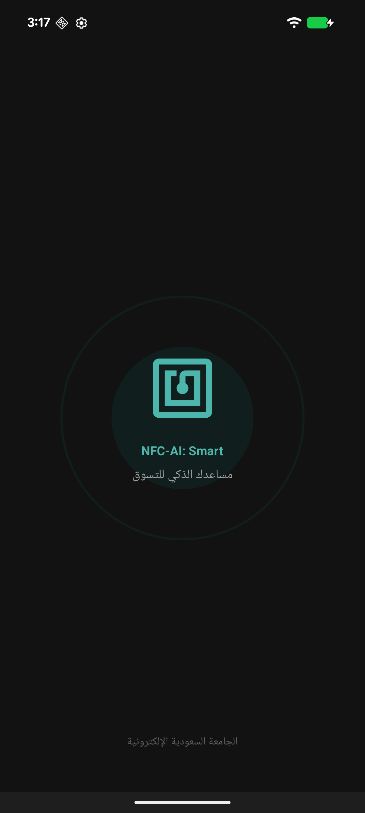{ width="300" }
  <figcaption>App launch — branded splash screen</figcaption>
</figure>

---

## 2. Welcome & Onboarding

First-time users set up their **language** preference and **dietary profile** (allergies, restrictions). This information drives the AI safety system — the app will never recommend products that conflict with these settings.

<figure markdown>
  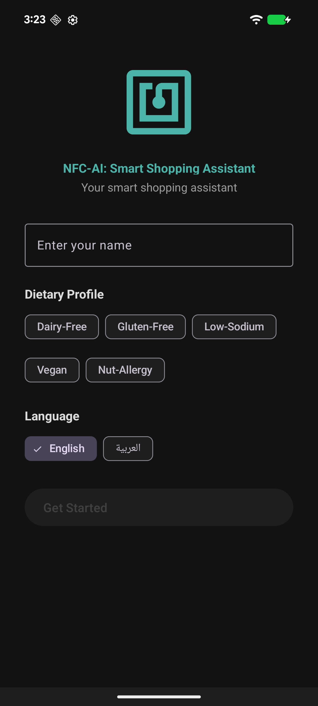{ width="300" }
  <figcaption>Welcome screen — language selection</figcaption>
</figure>

<figure markdown>
  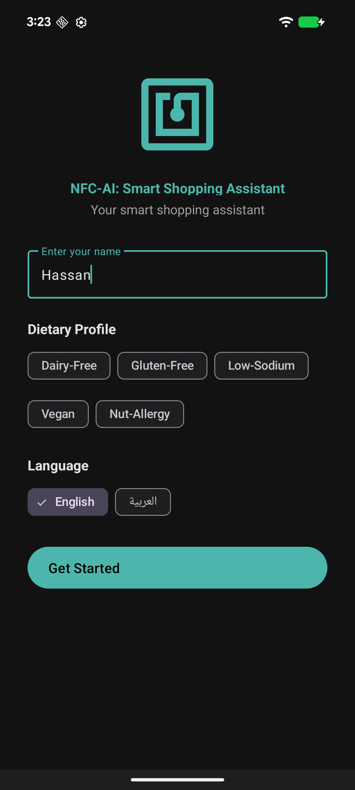{ width="300" }
  <figcaption>Dietary profile configured</figcaption>
</figure>

---

## 3. Home Screen & Interactive Tutorial

On first visit, an interactive **spotlight tutorial** guides users through every feature. The tutorial blocks navigation until completed, ensuring users understand the interface.

<figure markdown>
  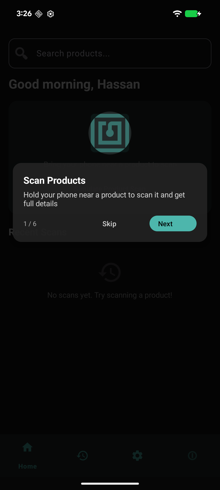{ width="300" }
  <figcaption>Spotlight tutorial — NFC scan area</figcaption>
</figure>

<figure markdown>
  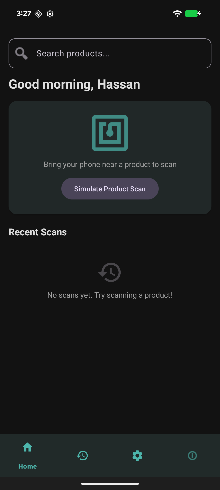{ width="300" }
  <figcaption>Clean home screen after tutorial</figcaption>
</figure>

---

## 4. NFC Scanning & Product Detail

Users tap their phone on a product's NFC tag. The app instantly looks up the product and displays full details: **nutrition facts**, **ingredients**, and **allergen warnings** matched to the user's profile.

<figure markdown>
  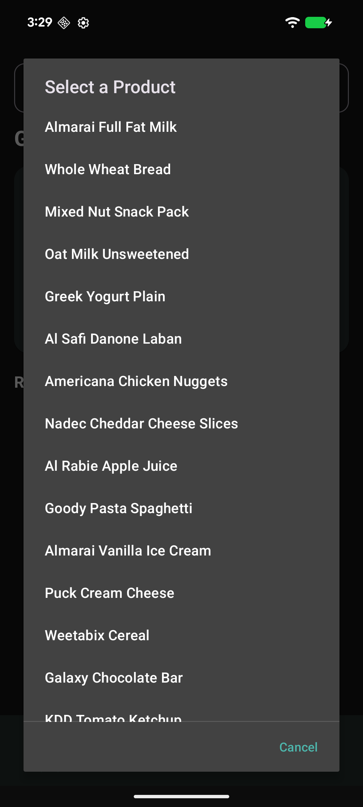{ width="300" }
  <figcaption>NFC scan simulation (for demo purposes)</figcaption>
</figure>

<figure markdown>
  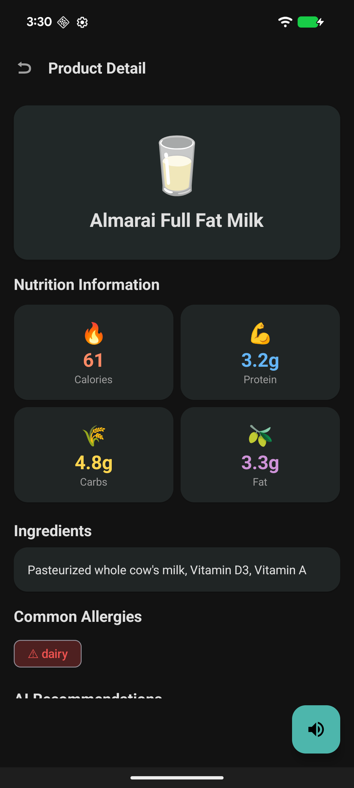{ width="300" }
  <figcaption>Product detail — nutrition, ingredients, allergens</figcaption>
</figure>

---

## 5. AI-Powered Recommendations

The AI analyzes the scanned product against the user's dietary profile and suggests **3 safe alternatives** with match percentages, reasons, and full nutrition data. A multi-layer safety pipeline ensures no dangerous suggestions.

<figure markdown>
  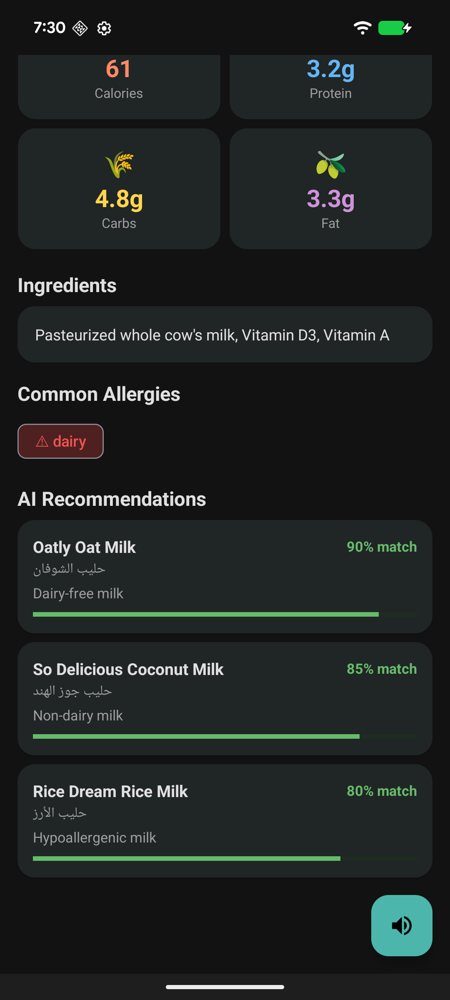{ width="300" }
  <figcaption>AI recommendations with safety verification</figcaption>
</figure>

<figure markdown>
  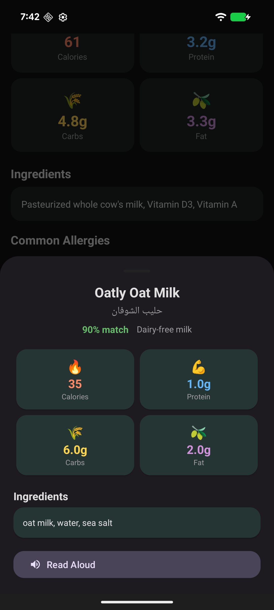{ width="300" }
  <figcaption>Tap a recommendation for full nutrition breakdown</figcaption>
</figure>

---

## 6. Scan History

Every scan is logged with timestamps. Users can **filter by date** and **clear history**.

<figure markdown>
  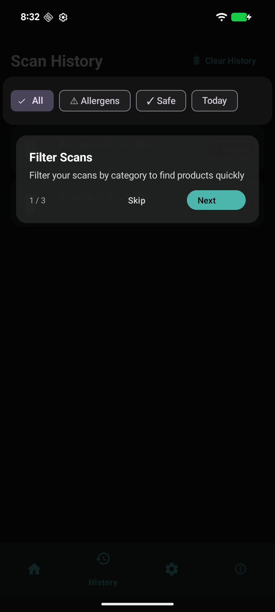{ width="300" }
  <figcaption>History screen tutorial</figcaption>
</figure>

<figure markdown>
  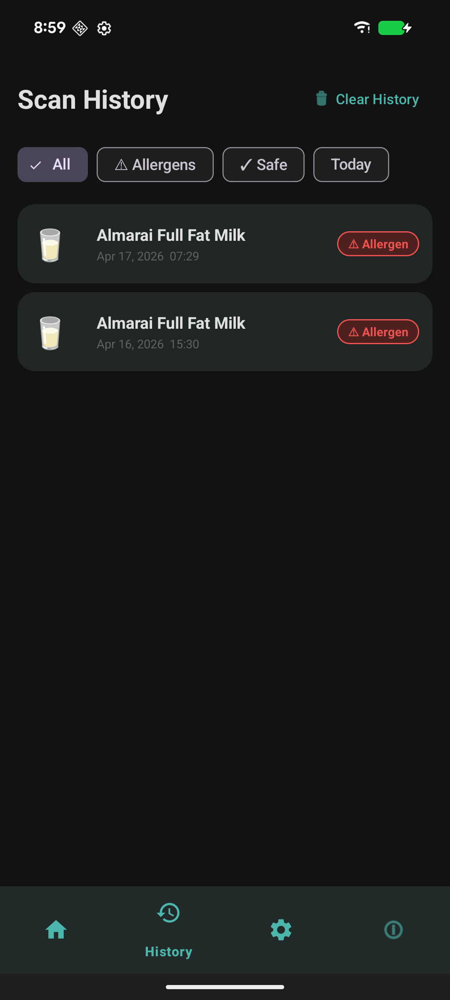{ width="300" }
  <figcaption>Scan history with product cards</figcaption>
</figure>

---

## 7. Settings & Accessibility

Comprehensive settings for **theme**, **font size**, **TTS speed**, dietary profile editing, and accessibility options including auto text-to-speech.

<figure markdown>
  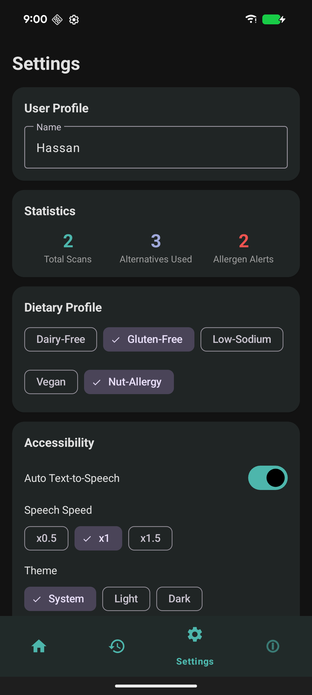{ width="300" }
  <figcaption>Settings — profile & dietary preferences</figcaption>
</figure>

<figure markdown>
  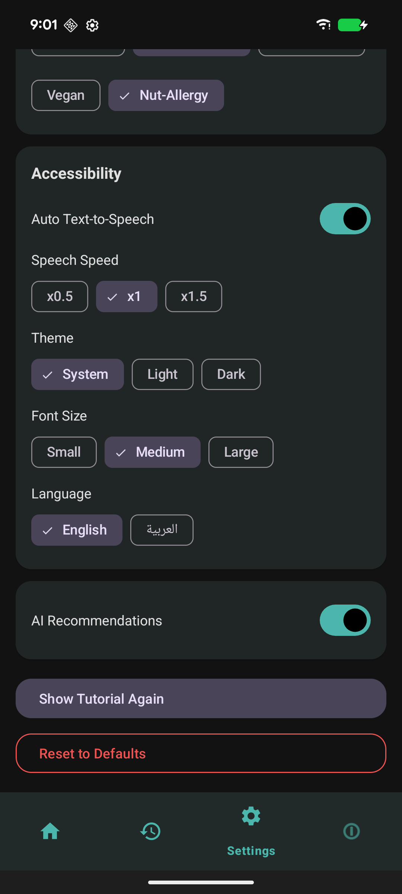{ width="300" }
  <figcaption>Settings — accessibility, AI, theme, font, TTS speed</figcaption>
</figure>

---

## 8. About & Home with Scans

<figure markdown>
  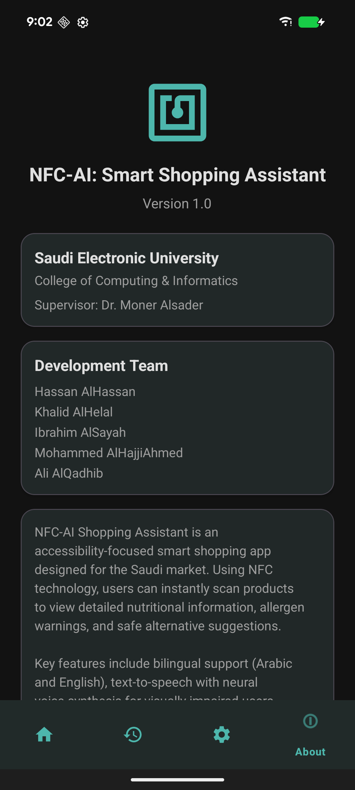{ width="300" }
  <figcaption>About screen — app version & team info</figcaption>
</figure>

<figure markdown>
  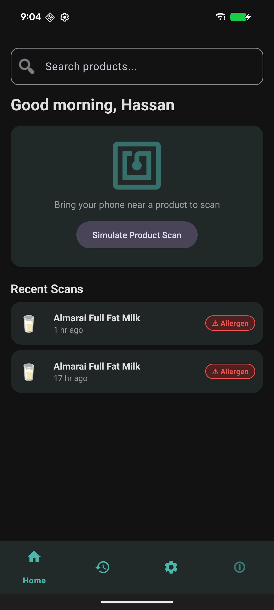{ width="300" }
  <figcaption>Home screen populated with recent scans</figcaption>
</figure>

---

## Next Steps

- Learn how to [scan products](nfc-scanning.md) using NFC tags.
- Explore [AI recommendations](ai-recommendations.md) for healthier alternatives.
- Adjust your experience in [Settings](settings.md).
